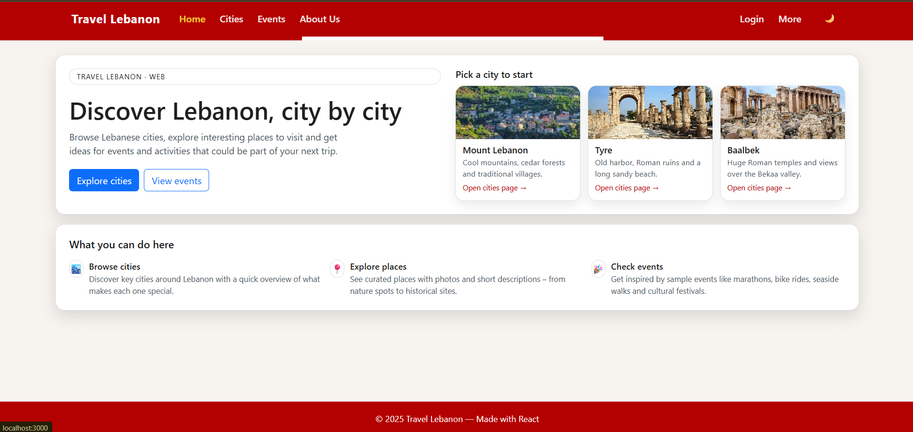
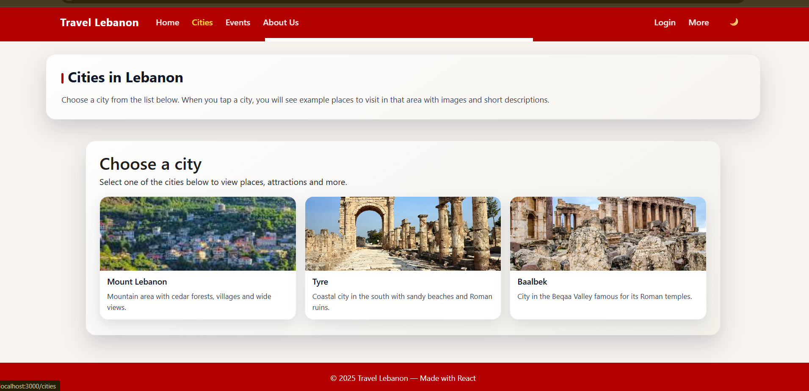
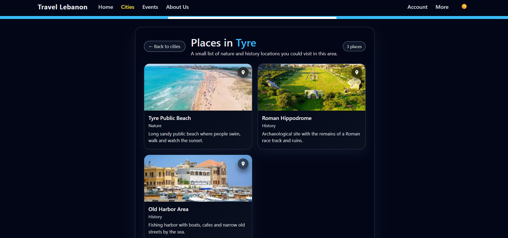
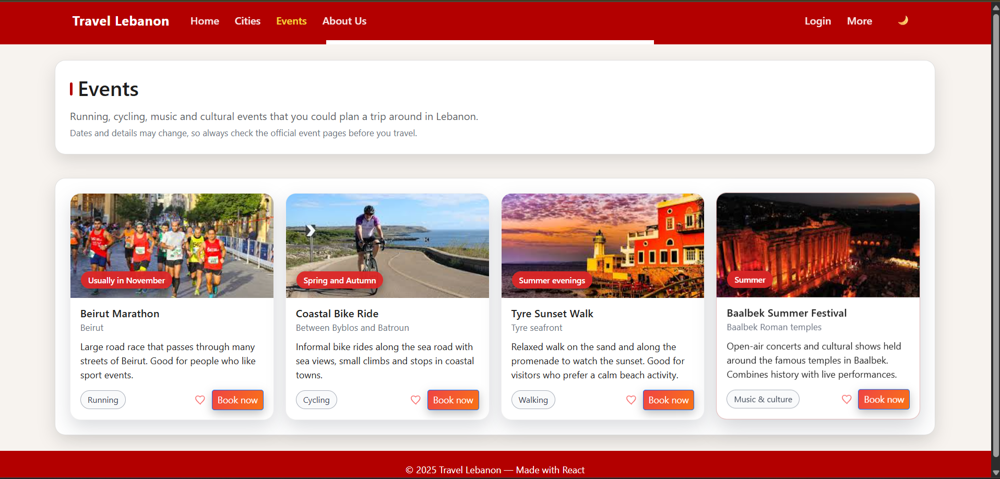
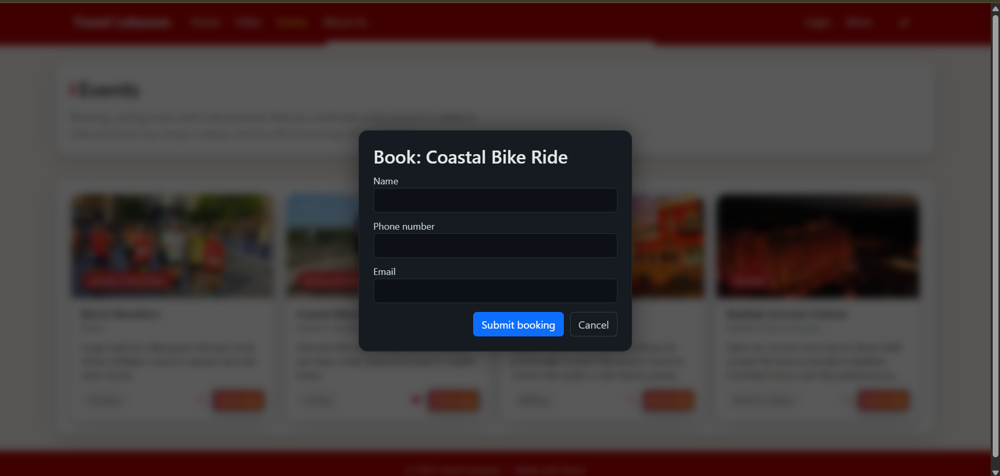
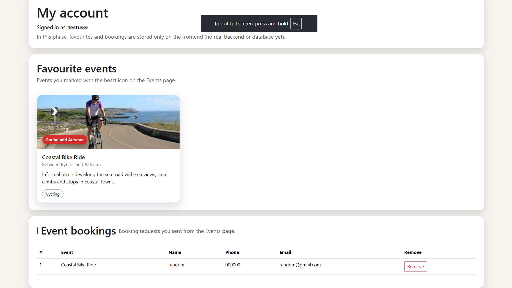
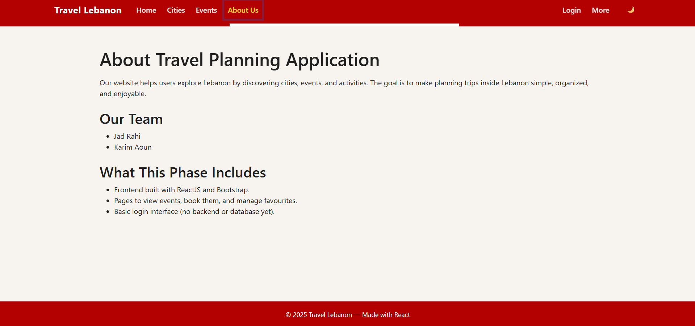

# 🌍 Travel Lebanon — React Web Project

A modern travel discovery website that helps users explore Lebanon by browsing **cities, places, events**, viewing photos, booking activities, marking favorites, and suggesting new places.

Built with **ReactJS**, **Bootstrap**, and Context API (local state).

---

## ✨ Features

### 🏠 Home Page
- Welcome text  
- Quick navigation to Cities and Events  
- Clean modern UI  

### 🏙️ Cities Page
- List of major Lebanese cities  
- Each city contains multiple places  
- Places include photos, descriptions, and Google Maps links  
- Light + Dark theme support  

### 🎉 Events Page
- View Lebanese events (marathons, biking, festivals…)  
- Add favorites ❤️  
- Book an event using a pop-up modal  

### 👤 Account Page
- Shows your **favorite events**  
- Shows your **event booking submissions**  
- Ability to remove bookings  

### 📝 Suggest a Place
- Form to submit new city/place ideas  
- Submissions appear in a table  
- Can remove suggestions  

### 🌗 Light / Dark Theme
- Toggle button in the navbar  
- Entire UI adapts instantly

---

## 📸 Screenshots

### 🏠 Home Page


### 🏙️ Cities Page


### 🌃 Dark Mode — Cities


### 🎉 Events Page


### 🌑 Dark Mode — Events


### 📩 Booking Modal


### 👤 Account Page


### 📝 Suggest a Place


### ℹ️ About Page


---

## 🛠️ How *I* run the project (Karim’s version)

> These are the commands **I use on my computer** when I want to run the website.

### 1️⃣ Open the project folder

```bash
cd "C:/Web project"
```

### 2️⃣ Open the React app folder

```bash
cd travel
```

### 3️⃣ Install dependencies (only needed the FIRST time)

```bash
npm install
```

### 4️⃣ Start the website

```bash
npm start
```

The website will open at:

👉 **http://localhost:3000**

---

## 📄 Notes

- No backend or database yet — everything is saved in the browser only.  
- This version is made for university project submission.

